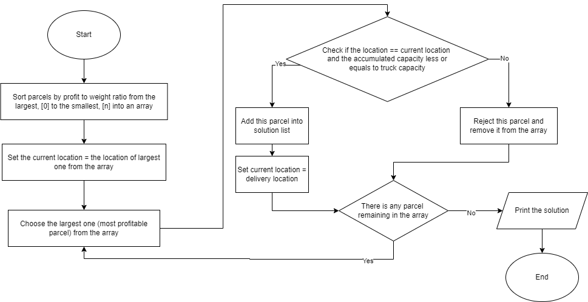

# PosLaju Delivery Strategy
## Transforming Delivery Efficiency Through Data-Driven Innovation Using 0/1 Knapsack and Prim's Algorithms
### Contents
[Overview](https://github.com/anishumairaa/Efficient-Delivery-Strategy/edit/main/README.md#overview)  
[Problem Statement](https://github.com/anishumairaa/Efficient-Delivery-Strategy/edit/main/README.md#problem-statement)  
[Objectives](https://github.com/anishumairaa/Efficient-Delivery-Strategy/edit/main/README.md#objectives)  
[Scenario Model](https://github.com/anishumairaa/Efficient-Delivery-Strategy/edit/main/README.md#scenario-model)  
[Proposed Solution](https://github.com/anishumairaa/Efficient-Delivery-Strategy/edit/main/README.md#proposed-solution)  
[Getting Started](https://github.com/anishumairaa/Efficient-Delivery-Strategy/edit/main/README.md#getting-started)

## Overview
PosLaju Delivery Strategy is a CSC4202 2025 Group 9 project that leverages algorithm analysis to optimize delivery operations.  
  
In optimizing its delivery operations, PosLaju faces the challenge of selecting the most profitable combination of parcels while minimizing the total delivery distance within the constraint of the lorry’s limited capacity. Selecting parcels that provide the highest profit without exceeding the truck’s weight limit is a combinatorial problem that requires careful decision-making. Additionally, determining the shortest possible delivery route to multiple destinations is crucial to reduce delivery time and operational costs. This dual-objective scenario presents a complex logistics problem that involves both parcel selection and route planning. Therefore, an efficient algorithmic solution is required to simultaneously address parcel selection for maximum profit and route optimization for minimum distance, ensuring timely deliveries and cost-effective operations.

## Problem statement

How can Pak Cik Adam delivery from Serdang hub to multiple destinations efficiently?

Pak Cik Adam
- has insufficient money to refuel the truck
- wants the highest payback

Poslaju delivery man wants to minimize the total distance traveled  to deliver parcels while also maximizing the profit earned from each delivery.

## Objectives

To determine the most efficient algorithm for optimizing parcel delivery, considering both profit maximization and route minimization under truck capacity constraints.

1. Analyze delivery data

2. Develop predictive models

3. Make informed decisions to improve efficiency and reduce costs


### 📊 Performance Evaluation Objectives

This project aims to identify the most efficient algorithm for delivery route optimization based on the following key metrics:

- 💰 **Total Profit Achieved**  
  Measure the profitability of each route by maximizing deliveries with the highest returns.

- 📏 **Total Distance Traveled**  
  Evaluate which algorithm produces the shortest path to reduce fuel costs and time.

- ⏱️ **Total Execution Time**  
  Compare the computational efficiency of each algorithm to ensure scalability in real-time systems.

- 🗺️ **Route Identification**  
  Determine the optimal delivery route starting from **Serdang**, covering multiple destinations effectively.

## Scenario Model  
### Visualization 
<p align="center">
  
</p>

### Data Type  
| No. | Data                             | Type                      | Description                                 |
|-----|----------------------------------|---------------------------|---------------------------------------------|
| 1   | Parcel ID                        | Integer                   | Unique identifier for each parcel           |
| 2   | Profit per Parcel                | Integer                   | Profit earned when delivering a parcel      |
| 3   | Truck Capacity                   | Integer (kg)              | Maximum available weight capacity in a truck|
| 4   | Weight                           | Integer (kg)              | Weight of a parcel                          |
| 5   | Hub location and delivery location | Categorical (e.g., Bukit Jalil) | Nodes in a graph                     |
| 6   | Distance Between Nodes           | Integer (kilometer)       | Distance between hub and delivery location  |

### Scenario Constraints  
- Can not exceed truck capacity  
All parcels that are selected can’t exceed the truck capacity. The truck capacity is decided in simulation’s methodology.  

- 0/1 decision only  
It must either deliver or not deliver the parcel. Delivery man should not choose both or half.  

- Route must be connected  
The selected parcel’s route must form a connection. Delivery man should not jump from one point to another without a path.  

- No cycles  
The route should not be cycled. Delivery man should not deliver the same parcel two times or more.  

## Proposed Solution  
### Methodology
1. Run Prim’s
2. From the result, use the total weight from Prim’s as Knapsack limit
3. Run Knapsack to see what profit is achievable with the weight limit
4. Compare the Prim’s route and Knapsack result

### Modified 0/1 Knapsack
  <p align="center">
  
</p>

### Prim's
  <p align="center">
  
</p>


## Getting Started
Prerequisites
This project requires:

Programming Language: Python, Google Colab

### Installation
1. Clone the repository:

```bash
git clone https://github.com/anishumairaa/Efficient-Delivery-Strategy
```

2. Navigate to the project directory:

```bash
cd Efficient-Delivery-Strategy
```

3.Install the dependencies:

```bash
pip install networkx matplotlib
```

4. Run the codes (in terminal)
```bash
python PoslajuDelivery.ipynb
```


Transforming Delivery Efficiency Through Data-Driven Innovation

